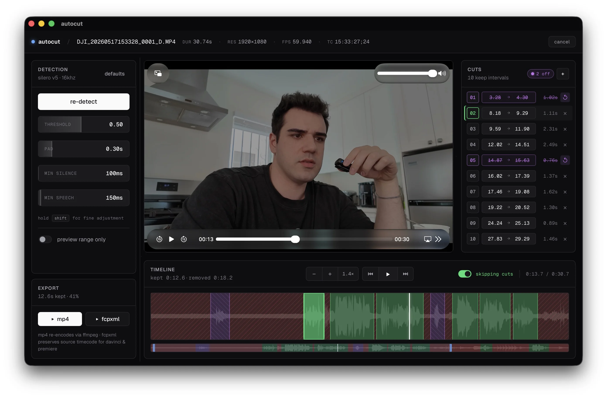

<p align="center">
  
</p>

<p align="center">
  Drop a video in, the silences come out.<br>
  Export an MP4, or hand the cut timeline to DaVinci Resolve and Premiere.
</p>

<p align="center">
  <a href="https://github.com/cobanov/autocut/releases/latest"></a>
  <a href="https://github.com/cobanov/autocut/actions/workflows/ci.yml"></a>
  
  
</p>

---

Cutting the pauses out of a talking head video is mechanical work: find the gap,
drag the edges in, ripple everything left, do it two hundred more times. What
automates it either wants your footage uploaded to somebody's server or wants
you to keep a Python environment alive next to your edit.

autocut is a desktop app. The footage stays on your disk, there is nothing to
install beside it (no Python, no ffmpeg), and what comes out is either a
finished MP4 or a timeline your NLE opens without a relink dialog.

```sh
brew install --cask cobanov/tap/autocut
```

- **Nothing is uploaded.** Silero V5 runs on your machine, and ffmpeg and
  ffprobe are bundled inside the app.
- **The sliders are instant.** The speech model reads the track once. Threshold,
  pad, min silence and min speech reshape a result autocut already holds, so
  tuning never re-runs the model.
- **The preview is the export.** The player skips the removed regions as it
  plays, so you hear the final cut before you commit to it.
- **Multi-track shoots stay in sync.** Other angles and a separate sound
  recorder get cut at the same points, aligned by their embedded timecode.
- **FCPXML that relinks itself.** Source timecode is preserved, so DaVinci and
  Premiere bind each clip to the original media instead of asking where it went.

**[autocut.cobanov.dev](https://autocut.cobanov.dev)** has the downloads and a
short walkthrough.

## Install

**macOS, Apple Silicon.** Homebrew is the easier path, because it clears the
Gatekeeper quarantine flag for you:

```sh
brew install --cask cobanov/tap/autocut
brew upgrade --cask autocut
```

Installing the `.dmg` by hand from [the latest release][latest] works too: drag
**autocut** into Applications, then run this once, or macOS calls the app
damaged and refuses to open it.

```sh
xattr -cr /Applications/autocut.app
```

The bundle is not notarized by Apple yet. That command is all the difference
between the two paths.

**Windows, x86_64.** Download `autocut_X.Y.Z_x64-setup.exe` (NSIS) or
`autocut_X.Y.Z_x64_en-US.msi` from [the latest release][latest]. The bundle is
unsigned, so SmartScreen warns on first launch: **More info**, then **Run
anyway**.

**Linux.** Build from source for now. Native builds are on the way.

## Use

1. **Drop a video** on the window, or click *browse files*. MP4, MOV, MKV, WebM
   and AVI all work.
2. **Hit *detect silences***. Spoken regions turn green on the timeline, silent
   ones red.
3. **Watch the preview.** Space plays and pauses. The player jumps the removed
   regions, so what you hear is what exports.
4. **Refine, if it needs it.** Drag the green edge handles, type exact in and out
   times in the **cuts** panel, or click the x on a row to park a keep (it turns
   purple, leaves the export, and comes back with one click).
5. **Export.** **MP4** for something you can send immediately, **FCPXML** for a
   timeline with the cuts already on it.

| Slider | Default | What it does |
| --- | --- | --- |
| `threshold` | `0.50` | How confident the model must be to call a chunk speech. Higher cuts more |
| `pad` | `0.30s` | Breathing room kept on both sides of every spoken region |
| `min silence` | `100ms` | Gaps shorter than this are not worth cutting, so they are merged back in |
| `min speech` | `150ms` | Bursts shorter than this are dropped, which kills clicks and lip noise |

| | |
| --- | --- |
| **space** | Play / pause |
| **shift** while dragging | Fine steps on any slider |
| **scroll** on the timeline | Pan left and right |
| **drag** in the navigator | Zoom into a section |

The first detect on a long video takes a moment, because that is the model
reading the whole track. Every re-detect after it is free.

## Multi-track shoots

Most edits are not one clip. Two cameras and a recorder on the table are still
one performance, and they have to be cut identically or they drift apart.

1. Drop your **main camera** on the window. That is the reference: it is what
   you preview, and everything else lines up against it.
2. In the **export** panel, hit **+ add** under *linked tracks* and pick the
   other angles and audio files.
3. Files carrying timecode are aligned from it and the row is marked `tc`. Files
   without it are assumed to have started together and marked `≈`, so type the
   real offset in seconds if they did not.
4. Recorded clean sound separately? Point **listen to** in the detection panel
   at that file. The analysis reads the good microphone, the cuts still apply to
   every track.
5. Export **FCPXML**. The main camera lands on V1, the other video above it, the
   audio below, every track cut at the same frames.

MP4 export still writes one file from the reference clip. A flat video has one
picture and one mix, and deciding which angle is on top and how the audio
balances is an edit, not a cut.

## How it is built

Svelte 5 and TypeScript in front, Rust and Tauri 2 behind, with ffmpeg and
ffprobe as bundled sidecars.

**Scoring and segmenting are separate steps**, which is the whole reason the
sliders feel instant. Silero scores each 512 sample chunk once (an hour of audio
is about 112k model invocations) and that vector is cached for the session.
Threshold, min silence and min speech are applied to the scores afterwards; pad
is applied later still, while inverting speech regions into cuts. None of the
four reaches the model, so moving a slider costs a pass over an array.

**Timecode is what makes an FCPXML relink.** DaVinci binds an asset to its media
by three checks: path, source media start timecode, and frame rate format. A
clip whose file carries `15:33:27;24` while the XML claims it starts at `0s`
opens the relink dialog even though the path is right. So the asset's `start`
carries the embedded timecode, every clip shifts by that same offset, and NTSC
drop frame is stamped `DF` with the canonical un-reduced denominators NLEs
expect (`60000` for 59.94, `24000` for 23.976).

**MP4 export goes through ffmpeg's concat demuxer**, not a `filter_complex
select` expression. The expression form scales with the number of keeps, and
past a few hundred intervals ffmpeg fails to allocate the parse tree and the
export dies. A flat list of `file` + `inpoint` + `outpoint` triples has no such
ceiling.

**Audio is decoded once, into `i16`.** The VAD and the timeline waveform want
exactly the same 16kHz mono decode, so one cache owns it and both read from it.
Keeping the samples in ffmpeg's native `s16le` and converting to float per chunk
halves what an hour costs in memory, 115MB instead of 230MB.

## Development

```sh
pnpm install
pnpm tauri:dev
```

The first Rust build downloads about 200MB of ffmpeg binaries into
`src-tauri/binaries/` (see `src-tauri/build.rs`).

```sh
pnpm test                                     # vitest, 41 assertions on the cut algebra
pnpm run check                                # svelte-check

cd src-tauri
AUTOCUT_STUB_SIDECARS=1 cargo test --lib      # 67 assertions, no download, no frontend build
cargo clippy --all-targets
cargo fmt --check
cargo run --example smoke -- clip.mp4         # probe and VAD over one file
```

`AUTOCUT_STUB_SIDECARS=1` drops empty placeholders where the ffmpeg binaries go,
so a fresh checkout runs the unit tests without fetching 200MB first. Nothing in
them shells out to ffmpeg. Never set it for a real build: the resulting bundle
cannot process video, and it says so loudly at compile time.

The version lives in `package.json`. `tauri.conf.json` reads it from there, and
CI checks that `src-tauri/Cargo.toml` agrees.

## Built by

[mert cobanov](https://cobanov.dev) · 2026

[latest]: https://github.com/cobanov/autocut/releases/latest
